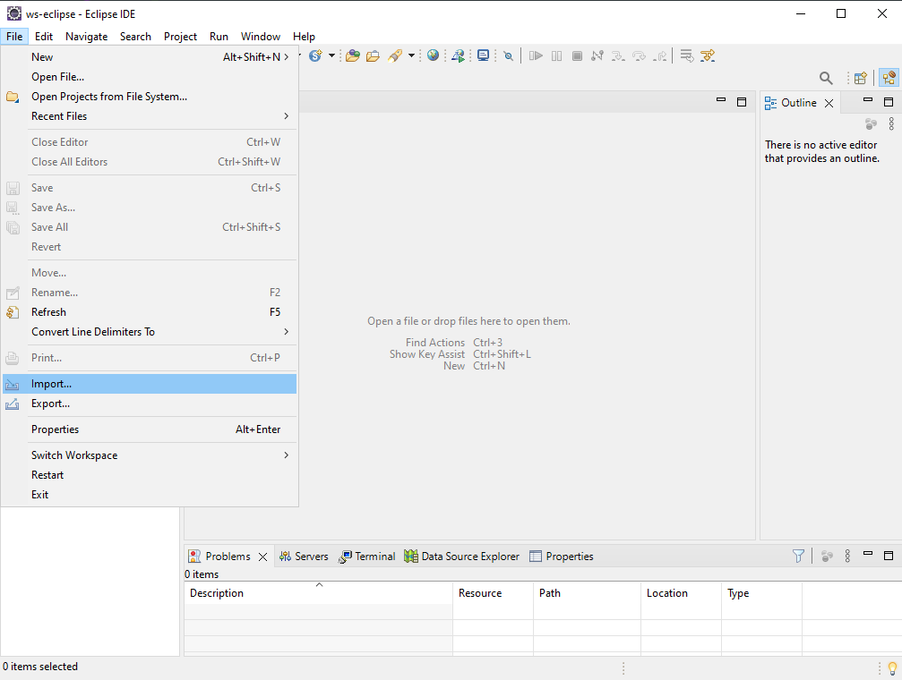
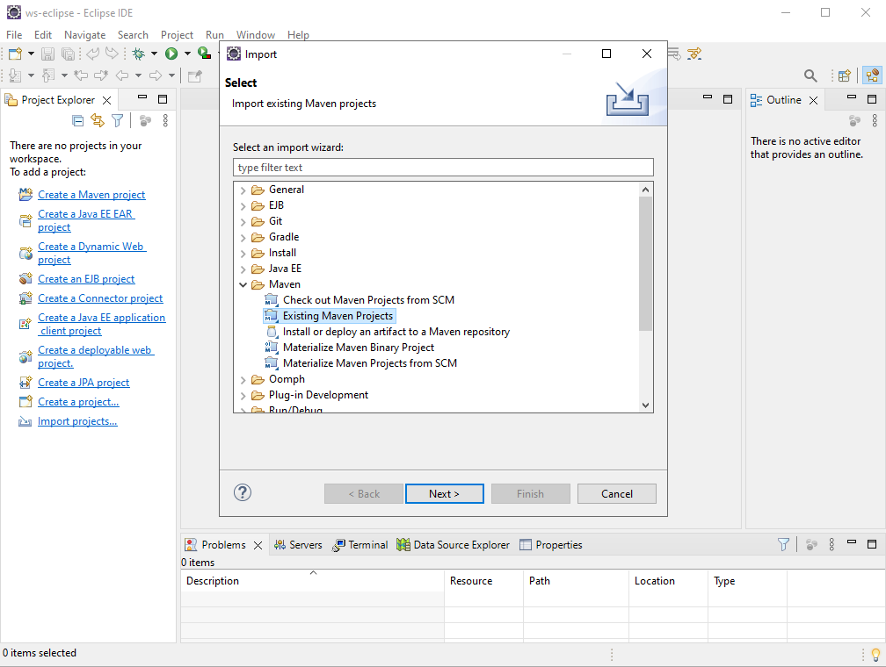
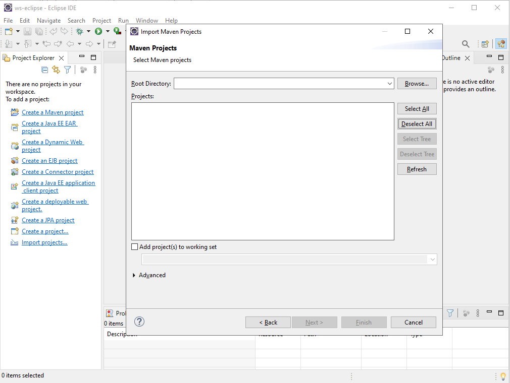
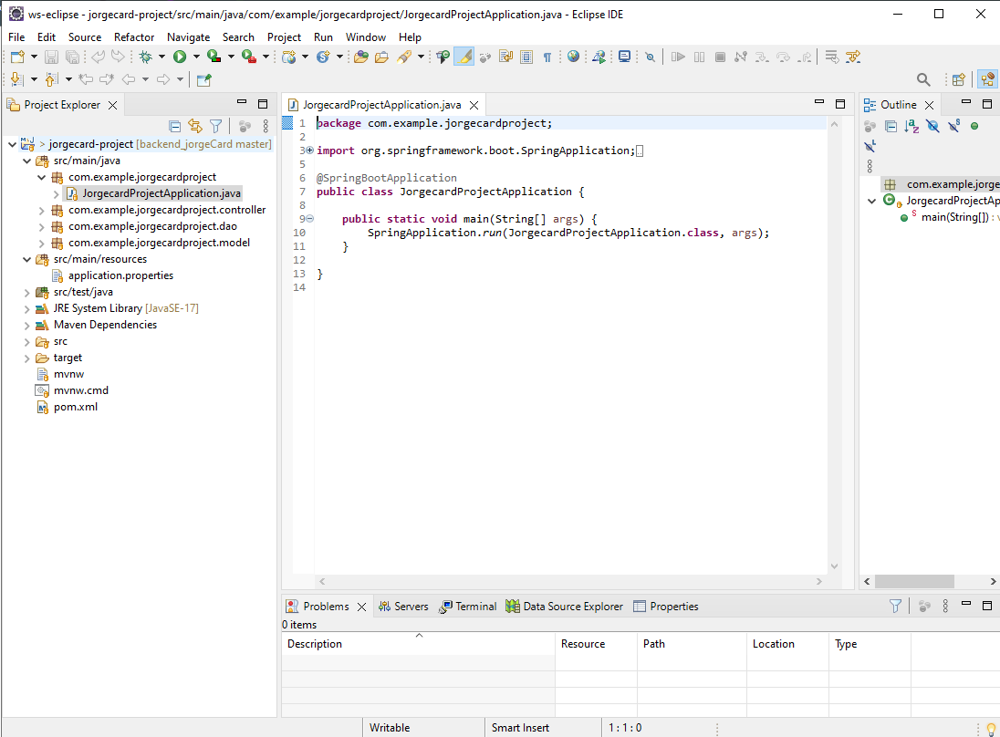

# API Jorge Card

## API desenvolvida em Java e framework Spring Boot. 

Objetivo desta API é conectar o site JorgeCard com o banco de dados MySQL utilizando os métodos do Crud Repository.

## Dependências utilizadas
- Spring Web: Permite criar aplicativos web, incluindo RESTful, usando Spring MVC. Usa Apache Tomcat como contêiner incorporado padrão.
- Spring Data JPA: Permite armazenar dados em SQL com java utilizando Spring Data e Hibernate.
- MySQL Driver: Serve para conectar com o banco de dados MySQL.
- Spring Boot Devtools: Permite que nossa aplicação seja reiniciada automaticamente após cara alteração de código, facilitando o desenvolvimento.
- Lombok: Cria automaticamente metodos Getters e Setters, deixa o sistema menos verboso.

## Requisitos para a API
- JDK17 ou superior - https://www.oracle.com/br/java/technologies/downloads/
- IDE que compile java de sua preferência, recomendo Eclipse IDE - https://eclipseide.org/
- Postman para testes ou de sua preferência - https://www.postman.com/downloads/
- banco de dados MySQL - https://dev.mysql.com/downloads/mysql/

## Importando o Projeto

Para executarmos a Api, será necessário importar o projeto para ser gerenciado pela ferramenta Maven, que será responsável por automatizar o projeto, auxiliando no ciclo de desenvolvimento incluindo compilação, controle de bibliotecas, distribuição e relatórios estatísticos. No exemplo a seguir foi utilizado Eclipse IDE mas a lógica serve para outras IDE's. 

- Abra o Eclipse IDE (caso seja a priveira vez que execute o aplicativo, o sistema irá pedir para configurar uma pasta padrão para ser salvo seus futuros projetos), após abrir vá em File e Import conforme exemplo a seguir:
  
  

- Selecione Projeto Maven Existente:

  

- Selecione o diretório do projeto e clique em Finish:

  

- Após importar, o projeto será carregado:

  

## Executando a API

Para executar a Api é necessário configurar os parâmetros de conexão com o banco de dados no arquivo application.properties em src/main/resorces/application.properties, basta preencher os campos em "" conforme a seguir:

```
spring.jpa.hibernate.ddl-auto=none
spring.datasource.url=jdbc:mysql://${MYSQL_HOST:localhost}:3306/"seu banco de dados"
spring.datasource.username="seu usuario"
spring.datasource.password="sua senha"
spring.datasource.driver-class-name=com.mysql.cj.jdbc.Driver
#spring.jpa.show-sql: true
```
após isto para subir a Api, basta executar a classe Main como Java Application na sua IDE, o resultado deve ser semelhante à figura abaixo.
Em desevolvimento(...)
